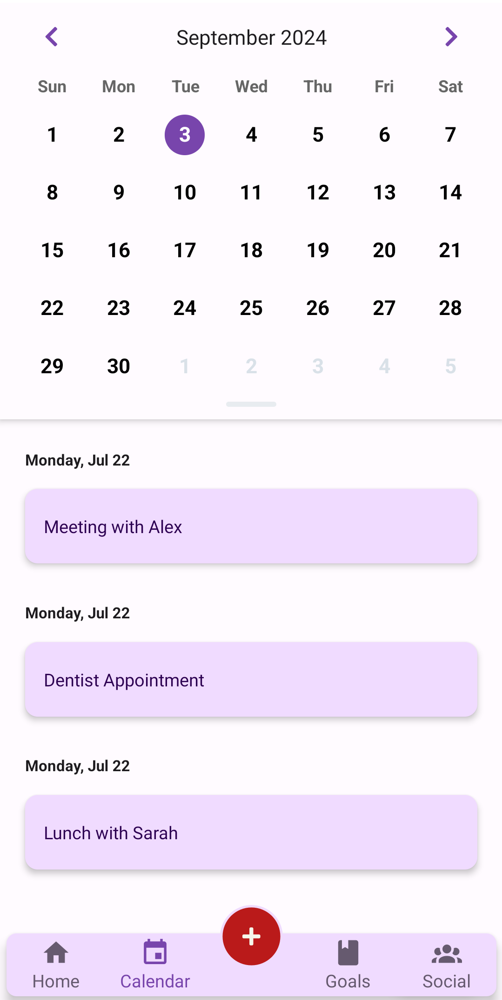

# OracleApp

## Overview
**Oracle** is a React Native application developed with Expo, designed for effective task and time management. By integrating a to-do list with time tracking features, Oracle helps users optimize their productivity and manage their responsibilities efficiently.

**Note: Early Development Stage**
- Please be advised that  this application is currently in the early stages of development. As such , many features are  still under construction and have not  yet been fully implemented. 

---
|  |  |
| ------------------------------------- | ------------------------------------- |

---
### Features
- **Task Management**: Easily create, edit, and delete tasks.
- **Due Dates**: Set due dates and receive reminders for important tasks.
- **Time Tracking**: Log the time spent on each task to analyze productivity.
- **Prioritization**: Assign priority levels to tasks for better focus.
- **Categorization**: Organize tasks into categories for easy access.
- **User-Friendly Interface**: An intuitive design ensures a seamless experience.


---
### Screenshots


## Installation

### Prerequisites
- Node.js (version 14 or higher)


### Steps
1. Install Expo CLI globally (if not already installed):
   ```bash
   npx expo install
2. Run the app:
   ```bash
   npx expo start
